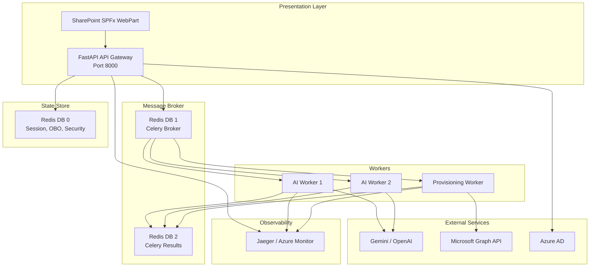

# SharePoint AI — Long-Term Scalability Architecture Plan

> **Goal**: Evolve from a single FastAPI container into a resilient, event-driven microservices architecture — without breaking any existing functionality.

## Current State Summary

| Component | Status |
|---|---|
| **API Server** | Single FastAPI container (`uvicorn src.main:app`) |
| **AI Calls** | Synchronous in-request (Gemini/OpenAI via `instructor`) — blocks HTTP thread |
| **SharePoint Ops** | Synchronous in-request Graph API calls — blocks HTTP thread |
| **State Store** | Redis 7 (conversation state, OBO cache, security store) |
| **Auth** | Azure AD JWT + OBO flow, per-IP rate limiting |
| **Resilience** | Circuit breakers (`graph_breaker`, `ai_breaker`) + retry decorator |
| **Observability** | Python `logging` module only — no distributed tracing |
| **Tests** | `tests/` directory exists but is empty |
| **CI/CD** | None |

---

## User Review Required

> [!IMPORTANT]
> This is a **major architectural evolution** split into 8 incremental phases. Each phase is independently deployable and testable. **No phase breaks existing functionality** — they all add capability on top of the current working system.

> [!WARNING]
> **Phases 2–3** (Celery workers) are the highest-impact changes. They move AI and provisioning work off the API thread. These require the most careful testing.

## Open Questions

> [!IMPORTANT]
> 1. **Celery broker**: Should we reuse the existing Redis instance as the Celery broker, or add a dedicated RabbitMQ? Redis is simpler; RabbitMQ is more reliable for large task queues.
> 2. **Deployment target**: Are you deploying to Azure Container Apps, AKS (Kubernetes), or a single VM with Docker Compose? This affects Phase 6 (API Gateway) and Phase 7 (CI/CD).
> 3. **Phase priority**: Do you want all 8 phases, or should we start with specific ones (e.g., Phase 5 Observability first)?

---

## Phase 1 — Docker & Infrastructure Hardening

**Goal**: Harden the existing single-container setup before splitting into services.

### [MODIFY] [Dockerfile](file:///home/abdulrhman-alshafee/Desktop/sharepoint/sharepointAi-project/sharepoint_ai/Dockerfile)

- Add non-root user for security
- Add health check instruction
- Pin Python package versions
- Add `.dockerignore` for faster builds

```dockerfile
FROM python:3.11-slim

RUN groupadd -r appuser && useradd -r -g appuser -d /app appuser
WORKDIR /app

COPY requirements.txt .
RUN pip install --no-cache-dir -r requirements.txt

COPY . .
RUN chown -R appuser:appuser /app

USER appuser
EXPOSE 8000

HEALTHCHECK --interval=30s --timeout=5s --retries=3 \
  CMD python -c "import httpx; httpx.get('http://localhost:8000/health')"

CMD ["uvicorn", "src.main:app", "--host", "0.0.0.0", "--port", "8000", "--workers", "2"]
```

### [NEW] [.dockerignore](file:///home/abdulrhman-alshafee/Desktop/sharepoint/sharepointAi-project/sharepoint_ai/.dockerignore)

```
.git
.venv
.mypy_cache
.pytest_cache
__pycache__
*.pyc
.env
scratch/
tests/
data/
```

### [MODIFY] [docker-compose.yml](file:///home/abdulrhman-alshafee/Desktop/sharepoint/sharepointAi-project/sharepoint_ai/docker-compose.yml)

- Add Redis password authentication
- Add memory limits to containers
- Add logging driver configuration

---

## Phase 2 — AI Orchestration Worker (Celery)

**Goal**: Move all AI provider calls (Gemini/OpenAI) to background Celery workers so they don't block API threads.

### Architecture

```
┌─────────────┐     ┌─────────┐     ┌──────────────────┐
│  FastAPI API │────▶│  Redis   │────▶│  AI Worker (x2)  │
│  (Gateway)   │◀────│ (Broker) │◀────│  Celery process  │
└─────────────┘     └─────────┘     └──────────────────┘
```

### [NEW] `src/workers/__init__.py`
### [NEW] `src/workers/celery_app.py`

Central Celery application configuration:
- Broker: `redis://redis:6379/1` (database 1, separate from state store on db 0)
- Result backend: `redis://redis:6379/2`
- Task serializer: `json`
- Task time limit: 120 seconds (AI calls can be slow)

### [NEW] `src/workers/ai_tasks.py`

Celery tasks wrapping existing AI calls:
- `classify_intent_task(message, history)` — wraps `GeminiIntentClassificationService.classify_intent()`
- `generate_blueprint_task(prompt, tenant_users)` — wraps `GeminiAIBlueprintGenerator.generate_blueprint()`
- `query_data_task(query, site_ids, ...)` — wraps `AIDataQueryService` query pipeline
- `generate_chat_reply_task(message, history)` — wraps the instructor chat completion

Each task:
1. Reuses the singleton AI client from `ServiceContainer`
2. Respects the existing `ai_breaker` circuit breaker
3. Returns JSON-serializable results
4. Has `autoretry_for=(RateLimitError,)` with exponential backoff

### [MODIFY] [chat_orchestrator.py](file:///home/abdulrhman-alshafee/Desktop/sharepoint/sharepointAi-project/sharepoint_ai/src/presentation/api/orchestrators/chat_orchestrator.py)

- Add a `USE_CELERY_WORKERS` setting (default `False` for backward compat)
- When enabled, replace `await intent_classifier.classify_intent(...)` with `classify_intent_task.delay(...).get(timeout=30)`
- Same pattern for blueprint generation and query execution

### [NEW] `Dockerfile.worker`

```dockerfile
FROM python:3.11-slim
WORKDIR /app
COPY requirements.txt .
RUN pip install --no-cache-dir -r requirements.txt
COPY . .
CMD ["celery", "-A", "src.workers.celery_app", "worker", "--loglevel=info", "--concurrency=2", "-Q", "ai_tasks"]
```

### [MODIFY] docker-compose.yml

Add the AI worker service:
```yaml
ai-worker:
  build:
    context: .
    dockerfile: Dockerfile.worker
  image: sharepoint-ai-worker
  env_file: .env
  environment:
    - REDIS_URL=redis://redis:6379/0
    - CELERY_BROKER_URL=redis://redis:6379/1
    - CELERY_RESULT_BACKEND=redis://redis:6379/2
  depends_on:
    redis:
      condition: service_healthy
  deploy:
    replicas: 2
  restart: unless-stopped
```

### [MODIFY] requirements.txt

Add: `celery[redis]>=5.3.0`

---

## Phase 3 — SharePoint Provisioning Worker

**Goal**: Offload heavy Graph API batch operations to a dedicated worker queue.

### [NEW] `src/workers/provisioning_tasks.py`

Celery tasks for provisioning:
- `provision_resources_task(command_dict, user_token, target_site_id)` — wraps `ProvisionResourcesUseCase.execute()`
- `create_folders_task(lib_id, folder_paths, site_id, user_token)` — wraps the folder creation loop
- `upload_workflow_templates_task(...)` — wraps workflow template upload

Each task:
1. Creates user-scoped repositories using the provided `user_token`
2. Respects `graph_breaker` circuit breaker
3. Stores progress in Redis (`provision:status:{task_id}`) for polling
4. Uses `acks_late=True` so tasks survive worker restarts

### [MODIFY] [provision_resources_use_case.py](file:///home/abdulrhman-alshafee/Desktop/sharepoint/sharepointAi-project/sharepoint_ai/src/application/use_cases/provision_resources_use_case.py)

- Add task progress callback support (updates Redis with % complete)
- No logic changes — the worker just calls `execute()` in a background process

### [NEW] `src/presentation/api/routes/task_status_controller.py`

New REST endpoint for polling task status:
- `GET /api/v1/tasks/{task_id}/status` — returns `{status, progress, result, error}`
- Frontend polls this instead of waiting on the HTTP response

### [MODIFY] docker-compose.yml

Add provisioning worker:
```yaml
provisioning-worker:
  build:
    context: .
    dockerfile: Dockerfile.worker
  command: ["celery", "-A", "src.workers.celery_app", "worker", "--loglevel=info", "--concurrency=1", "-Q", "provisioning_tasks"]
  env_file: .env
  environment:
    - REDIS_URL=redis://redis:6379/0
    - CELERY_BROKER_URL=redis://redis:6379/1
  depends_on:
    redis:
      condition: service_healthy
  restart: unless-stopped
```

> [!TIP]
> `--concurrency=1` for provisioning to avoid Graph API rate limits from parallel writes.

---

## Phase 4 — Redis High Availability

**Goal**: Configure Redis for production reliability.

### [MODIFY] docker-compose.yml

```yaml
redis:
  image: redis:7-alpine
  command: >
    redis-server
    --appendonly yes
    --maxmemory 512mb
    --maxmemory-policy allkeys-lru
    --requirepass ${REDIS_PASSWORD}
    --save 60 1000
    --save 300 100
  volumes:
    - redis-data:/data
  healthcheck:
    test: ["CMD", "redis-cli", "-a", "${REDIS_PASSWORD}", "ping"]
    interval: 10s
    timeout: 3s
    retries: 5
```

### [MODIFY] [config.py](file:///home/abdulrhman-alshafee/Desktop/sharepoint/sharepointAi-project/sharepoint_ai/src/infrastructure/config.py)

- Add `REDIS_PASSWORD: str = ""`
- Update `REDIS_URL` default to include password: `redis://:${REDIS_PASSWORD}@redis:6379/0`

### [MODIFY] [redis_security_store.py](file:///home/abdulrhman-alshafee/Desktop/sharepoint/sharepointAi-project/sharepoint_ai/src/infrastructure/services/redis_security_store.py)

- Add connection retry logic (3 attempts with backoff)
- Add Redis health check method for the `/health` endpoint

### [MODIFY] [conversation_state.py](file:///home/abdulrhman-alshafee/Desktop/sharepoint/sharepointAi-project/sharepoint_ai/src/presentation/api/services/conversation_state.py)

- Same retry logic as SecurityStore
- Add connection pool settings (max connections, timeout)

### [NEW] `.env.example` additions

```
REDIS_PASSWORD=your_strong_redis_password_here
```

---

## Phase 5 — Telemetry & Observability (OpenTelemetry)

**Goal**: Add distributed tracing across API → AI Worker → Graph API calls.

### [NEW] `src/infrastructure/telemetry.py`

OpenTelemetry setup:
- TracerProvider with OTLP exporter
- Resource attributes (service name, version, environment)
- Auto-instrumentation for FastAPI, httpx, Redis, Celery

### [MODIFY] [main.py](file:///home/abdulrhman-alshafee/Desktop/sharepoint/sharepointAi-project/sharepoint_ai/src/main.py)

- Call `setup_telemetry()` in the `lifespan` startup
- Add trace context propagation middleware

### [MODIFY] [graph_api_client.py](file:///home/abdulrhman-alshafee/Desktop/sharepoint/sharepointAi-project/sharepoint_ai/src/infrastructure/services/graph_api_client.py)

- Add span creation around each HTTP call with attributes:
  - `graph.endpoint`, `graph.method`, `graph.status_code`

### [MODIFY] [resilience.py](file:///home/abdulrhman-alshafee/Desktop/sharepoint/sharepointAi-project/sharepoint_ai/src/infrastructure/resilience.py)

- Add span events for circuit breaker state changes
- Add span events for retry attempts

### [MODIFY] requirements.txt

Add:
```
opentelemetry-api>=1.20.0
opentelemetry-sdk>=1.20.0
opentelemetry-exporter-otlp>=1.20.0
opentelemetry-instrumentation-fastapi>=0.41b0
opentelemetry-instrumentation-httpx>=0.41b0
opentelemetry-instrumentation-redis>=0.41b0
opentelemetry-instrumentation-celery>=0.41b0
```

### [MODIFY] docker-compose.yml

Add Jaeger (dev) or OTLP collector:
```yaml
jaeger:
  image: jaegertracing/all-in-one:1.50
  ports:
    - "16686:16686"  # UI
    - "4317:4317"    # OTLP gRPC
  environment:
    - COLLECTOR_OTLP_ENABLED=true
```

---

## Phase 6 — API Gateway Hardening

**Goal**: Harden the FastAPI presentation layer for production multi-instance deployment.

### [MODIFY] [main.py](file:///home/abdulrhman-alshafee/Desktop/sharepoint/sharepointAi-project/sharepoint_ai/src/main.py)

- Add request size limits (10MB max body)
- Add response timeout middleware (60s default)
- Add structured JSON logging (not plain text)

### [MODIFY] [dependencies.py](file:///home/abdulrhman-alshafee/Desktop/sharepoint/sharepointAi-project/sharepoint_ai/src/presentation/api/dependencies.py)

- Move rate limiter state to Redis (currently uses `slowapi` which is in-memory)
- Use `slowapi`'s Redis storage backend

### [MODIFY] [rate_limiter.py](file:///home/abdulrhman-alshafee/Desktop/sharepoint/sharepointAi-project/sharepoint_ai/src/infrastructure/rate_limiter.py)

- Configure `slowapi` with Redis backend for distributed rate limiting

### [NEW] `src/presentation/api/middleware/request_logging.py`

Structured request/response logging middleware:
- Log: method, path, status, duration_ms, user_email, correlation_id
- Format: JSON for log aggregation tools

### Health Check Enhancement

### [MODIFY] [main.py](file:///home/abdulrhman-alshafee/Desktop/sharepoint/sharepointAi-project/sharepoint_ai/src/main.py) — `/health` endpoint

Add checks for:
- Redis connectivity + latency
- Celery worker availability (inspect ping)
- AI provider reachability
- Graph API reachability

---

## Phase 7 — CI/CD & Testing Pipeline

**Goal**: Establish automated testing and deployment.

### [NEW] `tests/unit/test_intent_detection.py`

Unit tests for the detection layer (pure logic, no external calls).

### [NEW] `tests/unit/test_resilience.py`

Unit tests for circuit breaker and retry logic.

### [NEW] `tests/integration/test_chat_orchestrator.py`

Integration tests with mocked AI and Graph clients.

### [NEW] `tests/conftest.py`

Shared fixtures: mock AI client, mock Graph client, test Redis.

### [NEW] `.github/workflows/ci.yml`

```yaml
name: CI
on: [push, pull_request]
jobs:
  test:
    runs-on: ubuntu-latest
    services:
      redis:
        image: redis:7-alpine
        ports: ["6379:6379"]
    steps:
      - uses: actions/checkout@v4
      - uses: actions/setup-python@v5
        with:
          python-version: '3.11'
      - run: pip install -r requirements.txt
      - run: pytest tests/ -v --tb=short
  
  lint:
    runs-on: ubuntu-latest
    steps:
      - uses: actions/checkout@v4
      - run: pip install ruff mypy
      - run: ruff check src/
      - run: mypy src/ --ignore-missing-imports

  build:
    needs: [test, lint]
    runs-on: ubuntu-latest
    steps:
      - uses: actions/checkout@v4
      - run: docker compose build
```

---

## Phase 8 — Production Readiness

**Goal**: Final hardening for production deployment.

### [MODIFY] [config.py](file:///home/abdulrhman-alshafee/Desktop/sharepoint/sharepointAi-project/sharepoint_ai/src/infrastructure/config.py)

Add production settings:
- `ENVIRONMENT: str = "development"` (development / staging / production)
- `ENABLE_CELERY_WORKERS: bool = False`
- `CELERY_BROKER_URL: str = "redis://redis:6379/1"`
- `CELERY_RESULT_BACKEND: str = "redis://redis:6379/2"`
- `OTEL_EXPORTER_OTLP_ENDPOINT: str = ""`
- `MAX_REQUEST_SIZE_MB: int = 10`
- `REQUEST_TIMEOUT_SECONDS: int = 60`

### [NEW] `docker-compose.prod.yml`

Production override with:
- No port exposure for Redis
- Multiple API replicas behind a load balancer
- Resource limits (CPU, memory) for all services
- Log rotation

### [NEW] `scripts/healthcheck.sh`

Script for Kubernetes/Docker health probes.

---

## Final Target Architecture



---

## Verification Plan

### Automated Tests
- `docker compose build` — all images build successfully
- `docker compose up` — all services start and pass health checks
- `pytest tests/` — all unit and integration tests pass
- `docker compose exec sharepoint-ai curl localhost:8000/health` — returns `{"status": "healthy"}`

### Manual Verification
- Send a chat message via SPFx → verify response returns correctly
- Create a list via provisioning → verify it appears in SharePoint
- Check Jaeger UI for distributed traces across API → Worker → Graph
- Kill a worker → verify API degrades gracefully (falls back to in-process)
- Verify Redis persistence: restart Redis → check OBO cache survives

### Phase-by-Phase Rollout
Each phase is deployed independently. After each phase:
1. Run `docker compose down && docker compose build && docker compose up -d`
2. Run the health check
3. Test the chat flow end-to-end
4. Check logs for errors
